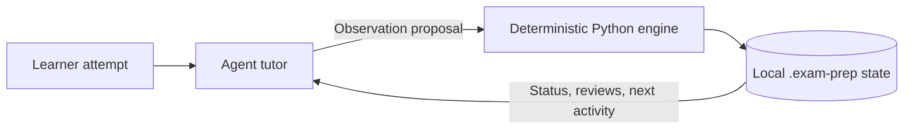

# Exam Prep

An evidence-driven Agent Skill for preparing for one exam by a fixed date. It
turns a learner's own materials and exam requirements into a local curriculum,
records every assessable attempt, and uses a deterministic Python engine to
plan reviews and time-boxed study sessions.

Exam Prep is designed for agent hosts that can load skills. The installable
package lives in [`skill/exam-prep/`](skill/exam-prep/); learner data stays in a
separate `.exam-prep/` directory inside the active study workspace.

[Quick start](#quick-start) · [How it works](#how-it-works) ·
[Daily workflow](#daily-workflow) · [Command reference](skill/exam-prep/references/commands.md) ·
[Limitations](#current-limitations)

## Why use it?

- **Attempts, not confidence, drive mastery.** Reading a solution or saying “I
  understand” does not count as independent evidence.
- **Progress survives the chat.** The append-only observation log is the
  canonical learner record; derived mastery and review state can be rebuilt.
- **Plans fit the available time.** The engine selects a useful next activity
  against the learner's exam horizon, prerequisites, due reviews, and stated
  time budget.
- **The exam format changes the teaching track.** Fixed oral-ticket exams use
  staged recall; problem sets and mixed exams use an intuition-to-transfer
  progression.
- **The core is local and dependency-free.** The runtime uses the Python
  standard library and does not require a database, hosted account, or external
  source provider.

## How it works

The agent handles conversation and diagnosis. The Python engine validates
structured observations, calculates mastery and review state, and persists the
result locally.



The boundary is intentional: the model can explain, ask questions, and classify
an error, but it cannot promote mastery by assertion. The engine derives
independence from the recorded outcome and assistance level. A full solution is
stored as exposure and must be followed by a structurally different learner
attempt.

See the [pedagogy protocol](skill/exam-prep/references/pedagogy.md) for the H0–H5
assistance ladder and the tracks selected by `course.exam.question_model`.

## Requirements

- Python 3.11 or newer is the documented target. The repository currently has
  no packaging metadata that enforces this version.
- An agent host that supports local skills is needed for the conversational
  tutor. The Python CLI can be inspected and tested independently.
- No third-party Python runtime packages are required.
- Optional `pypdfium2` enables PDF rendering and figure extraction; optional
  `pypdf` enables PDF text fallback. Without them, non-PDF materials and the
  rest of the engine continue to work.

## Install

Clone the repository, then copy the self-contained `skill/exam-prep/` directory
into your agent host's skills directory. The exact destination depends on the
host. The copied directory—the one containing `SKILL.md`—is referred to below
as `<skill-dir>`.

You can verify the package before installing it:

```bash
python skill/exam-prep/scripts/exam_prep.py --help
```

There is no package installer and no `exam-prep` executable added to `PATH`.
Every command is a subcommand of `scripts/exam_prep.py`.

## Quick start

Keep the skill package and learner workspace separate. Pass `--workspace`
explicitly when there is any chance the current directory points at a different
course.

```bash
python <skill-dir>/scripts/exam_prep.py --workspace <course-dir> status
python <skill-dir>/scripts/exam_prep.py --workspace <course-dir> init
python <skill-dir>/scripts/exam_prep.py --workspace <course-dir> ingest-materials <materials-dir> --mode lightweight
python <skill-dir>/scripts/exam_prep.py --workspace <course-dir> hydrate-source lecture-01.pdf#p3 --materials-dir <materials-dir>

python <skill-dir>/scripts/exam_prep.py --workspace <course-dir> validate-curriculum <curriculum-proposal.json>
python <skill-dir>/scripts/exam_prep.py --workspace <course-dir> apply-curriculum <curriculum-proposal.json>

python <skill-dir>/scripts/exam_prep.py --workspace <course-dir> start
python <skill-dir>/scripts/exam_prep.py --workspace <course-dir> next --minutes 25
```

Run `status` first. A new workspace reports `uninitialized` without creating
files; `init` creates `.exam-prep/`, and running `init` again is a safe no-op.

The learner normally supplies course materials and the official exam question
list in chat. The agent drafts the curriculum rather than asking the learner to
hand-author JSON. Curriculum validation is a dry run that checks identifiers,
prerequisites, cycles, capability mappings, and source coverage before state is
changed. Use the
[`CurriculumProposal` schema](skill/exam-prep/schemas/curriculum-proposal.schema.json)
and [example proposal](skill/exam-prep/examples/curriculum-proposal.json) as the
payload contract.

## Daily workflow

After the workspace and curriculum exist, the common loop is:

```bash
python <skill-dir>/scripts/exam_prep.py --workspace <course-dir> status --compact
python <skill-dir>/scripts/exam_prep.py --workspace <course-dir> review-due
python <skill-dir>/scripts/exam_prep.py --workspace <course-dir> next --minutes 25
python <skill-dir>/scripts/exam_prep.py --workspace <course-dir> record-observation <observation.json>
python <skill-dir>/scripts/exam_prep.py --workspace <course-dir> end-session
```

Only `record-observation` should add learner evidence. Build each v2 payload
from the
[`observation-proposal-v2` schema](skill/exam-prep/schemas/observation-proposal-v2.schema.json)
or [valid example](skill/exam-prep/examples/observation-proposal.json); do not
invent engine-owned timestamp, session, timing, or independence fields.

Useful inspection and recovery commands include:

| Command | Purpose |
| --- | --- |
| `status [--compact]` | Read the current workspace and resume point. |
| `roadmap` | Show targets, mastery, review state, and availability. |
| `mistakes` | Show unresolved recurring error patterns. |
| `review-due` | Show due and overdue reviews. |
| `validate` | Diagnose the full workspace without repairing it. |
| `rebuild` | Recompute derived state from canonical observations. |
| `verify <path>` | Check supported derivative or antiderivative answers. |

The [command catalog](skill/exam-prep/references/commands.md) documents every
subcommand, payload, workspace-resolution rule, and migration path.

## Mock exams

The exam blueprint is stored in `.exam-prep/course.json`. It can model
`ticket_list`, `problem_set`, `mixed`, or `open` exams, plus written, oral, or
mixed delivery.

```bash
python <skill-dir>/scripts/exam_prep.py --workspace <course-dir> update-exam-blueprint <blueprint-patch.json>
python <skill-dir>/scripts/exam_prep.py --workspace <course-dir> mint-assessments <mock-pool.json>
python <skill-dir>/scripts/exam_prep.py --workspace <course-dir> exam --minutes 30
python <skill-dir>/scripts/exam_prep.py --workspace <course-dir> end-session
```

An attempt against a frozen mock ticket must copy that ticket's `assessment_id`
into its observation proposal. `task_id` identifies the activity but does not
bind the attempt to the ticket. An omitted binding is preserved as ordinary
evidence and diagnosed, while the mock ticket remains unattempted.

## State and recovery

The active workspace stores runtime data in `.exam-prep/`:

- `course.json` and `syllabus.json` describe the course and exam;
- `observations.jsonl` is the canonical append-only evidence log;
- `assessments.jsonl`, `source_evidence.jsonl`, and `sources.json` hold frozen
  assessments and registered provenance;
- `targets.json` and `review_queue.json` are rebuildable derived snapshots;
- `learner.json` and `session.json` are protected snapshots;
- `revisions/` and `recovery/` support multi-file write recovery.

Stateful commands use a shared recovery path. If a derived snapshot is stale,
the engine can replay canonical observations. The project does not claim
whole-directory atomicity, so keep normal filesystem backups for important
study data.

## Optional NotebookLM integration

NotebookLM (Gemini Notebook) can be connected by the agent host as an optional
source provider. It is not a dependency of the Python core and never owns the
canonical learner record.

Connector availability is not consent. Installation, authentication, sending
course material, and every external write require explicit confirmation that
names the material and destination. Declining leaves the local workflow intact.

This path is experimental and has not been exercised end to end in the
repository's recorded scenarios. Its recommended upstream integration uses
undocumented Google endpoints and account browser cookies. Enable it only after
reviewing the authentication and data boundary in the
[NotebookLM integration notes](skill/exam-prep/references/notebooklm-mcp.md).
Core study, review, mock exam, state, and recovery workflows continue to work
without it.

## Current limitations

- Deterministic tests verify the Python engine and persistence behavior; they do
  not prove that every agent host will activate or follow the skill correctly.
- Fresh-context behavioral evaluation requires external model runs. The
  repository includes the scenario exporter and evaluator, but not versioned
  transcripts that would support a current comparative quality claim.
- Positive and negative activation packets can be exported, but versioned
  live-host activation results are not included.
- `verify` currently supports derivatives and antiderivatives only. Limits,
  series, algebraic identities, and other answer types return `unavailable` or
  require tutor judgment.
- Photograph and handwriting workflows have not been tested in the recorded
  scenarios.
- Releases are packaged by `.github/workflows/release.yml` when a v*.*.* tag
  is pushed. The repository has no separate test-CI workflow; reuse and
  distribution are covered by the [MIT license](LICENSE).

Treat the project as a developer-facing, experimental skill until the relevant
host behavior and optional integrations have been independently exercised.

## Repository layout

```text
skill/exam-prep/
├── SKILL.md           Agent contract
├── scripts/           CLI entrypoint and deterministic engine
├── schemas/           JSON payload and state contracts
├── examples/          Valid example payloads
├── references/        Commands, pedagogy, verification, and source rules
├── templates/         Initial workspace files
└── config/            Illustrative configuration template
tests/                 Unit, integration, and deterministic scenario tests
```

Start with [`skill/exam-prep/SKILL.md`](skill/exam-prep/SKILL.md) for the agent
contract, then use these focused references:

- [Commands and payloads](skill/exam-prep/references/commands.md)
- [Pedagogy and assistance levels](skill/exam-prep/references/pedagogy.md)
- [Exam prioritization](skill/exam-prep/references/exam-optimizer.md)
- [Source authority and conflicts](skill/exam-prep/references/source-of-truth.md)
- [Numeric and symbolic verification](skill/exam-prep/references/verification.md)

## Development

Run the deterministic test suite from the repository root:

```bash
python -m unittest discover -s tests -t .
python tests/scenarios/run_scenarios.py --deterministic
```

The first command covers the CLI, schemas, persistence, recovery, scheduling,
assessment integrity, and contract checks. The scenario runner exercises
deterministic runtime behavior; fresh-context agent behavior is a separate
manual or host-level evaluation described in
[`tests/scenarios/baseline-prompts.md`](tests/scenarios/baseline-prompts.md).
